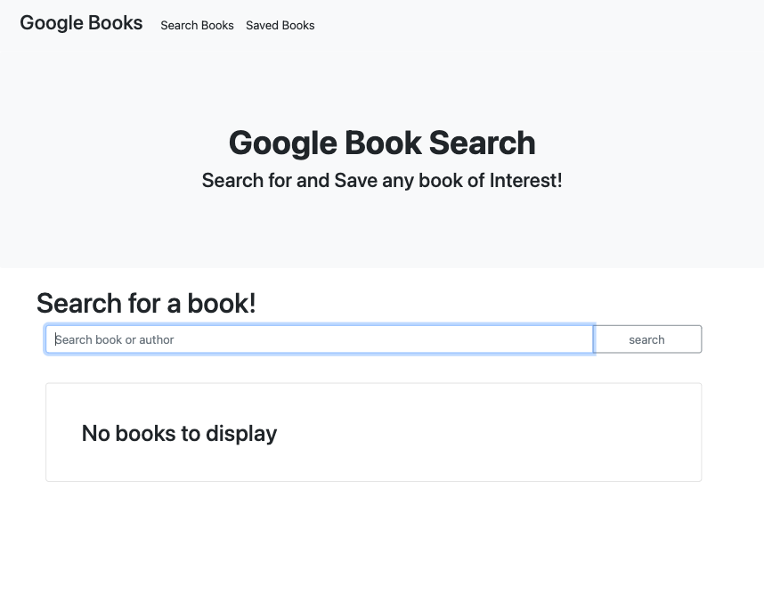

# Google Book Search

## Description

This appication was built with React. Typeing a name of a book or author in the search bar will then render up to 10 books associated with the search keyword(s). Have the ability to view an external link of the book for more information, or even save the book to your Saved favorites page for later use. A live link of the website can be viewed [HERE!](https://levisbooksearch.herokuapp.com/search)

## Table of Contents

- [Installation](#Installation)
- [Usage](#Usage)
- [License](#License)
- [Questions](#Questions)

## Installation

In order to run the program, you'll first have to fork the repo. In the terminal you'll run npm install to install all dependencies.

## Usage

While in the project's root folder, in the terminal, you'll type

    npm start

and React will launch a new window in your browser at localhost:3000

## License

None

## Badges

## Questions

If you have any questions, reach out to me through my [Github](www.github.com/levickane) .
